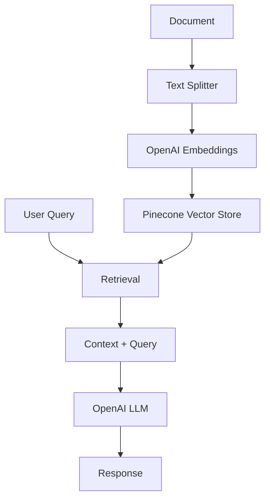

# Medium RAG: Building AI Agents in LegalTech

A Retrieval-Augmented Generation (RAG) system built with LangChain, OpenAI, and Pinecone for querying legal technology content about AI agents.

## 🚀 Features

- **Document Ingestion**: Automatically processes and chunks legal tech content
- **Vector Search**: Uses Pinecone for semantic search
- **RAG Pipeline**: Combines retrieval with OpenAI's GPT for accurate responses
- **LangSmith Integration**: Full tracing and monitoring capabilities
- **Modular Design**: Clean, maintainable code structure

## 📁 Project Structure

```
medium-rag/
├── main.py                    # RAG query system
├── ingestion.py              # Document ingestion pipeline
├── medium-building-ai-agents-in-legaltech.txt  # Source document
├── .env                      # Environment variables
├── pyproject.toml           # Dependencies
└── README.md                # This file
```

## 🛠️ Setup

### Prerequisites

- Python 3.11+
- OpenAI API key
- Pinecone account
- LangSmith account (optional)

### Installation

1. **Clone the repository**
   ```bash
   git clone <your-repo-url>
   cd medium-rag
   ```

2. **Install dependencies**
   ```bash
   uv sync
   ```

3. **Configure environment**
   ```bash
   cp .env.example .env
   # Edit .env with your API keys
   ```

4. **Set up environment variables**
   ```bash
   # Required
   OPENAI_API_KEY=your_openai_api_key_here
   PINECONE_API_KEY=your_pinecone_api_key_here
   INDEX_NAME=ai-agents-legaltech-rag
   
   # Optional (for monitoring)
   LANGCHAIN_TRACING_V2=true
   LANGCHAIN_API_KEY=your_langsmith_api_key_here
   LANGCHAIN_PROJECT=medium-rag-project
   ```

## 🚀 Usage

### 1. Ingest Documents

First, run the ingestion pipeline to process your documents:

```bash
python ingestion.py
```

This will:
- Load the legal tech document
- Split it into chunks (1000 characters each)
- Create embeddings using OpenAI
- Store vectors in Pinecone (creates index automatically)

### 2. Query the System

Run the RAG system to ask questions:

```bash
python main.py
```

Example queries:
- "What are the top 3 lessons learned from Building AI Agents in LegalTech?"
- "How can AI agents improve legal workflows?"
- "What challenges exist in legal AI implementation?"

## 🔧 Configuration

### Chunk Settings
```python
CHUNK_SIZE = 1000        # Characters per chunk
CHUNK_OVERLAP = 0        # Overlap between chunks
```

### Model Settings
- **Embeddings**: OpenAI `text-embedding-ada-002`
- **LLM**: OpenAI GPT models
- **Vector Store**: Pinecone with cosine similarity

## 📊 Monitoring

With LangSmith integration, you can:
- Track query performance
- Monitor retrieval quality
- Debug RAG pipeline issues
- Analyze conversation flows

Visit [LangSmith](https://smith.langchain.com) to view your traces.

## 🏗️ Architecture



## 🛠️ Development

### Code Structure

- **`main.py`**: RAG query system with modular functions
- **`ingestion.py`**: Document processing pipeline
- **Error handling**: Comprehensive try-catch blocks
- **Type hints**: Full typing support
- **Logging**: Detailed progress tracking

### Key Functions

**main.py:**
- `setup_embeddings()`: Initialize OpenAI embeddings
- `setup_vectorstore()`: Connect to Pinecone
- `query_vectorstore()`: Execute RAG queries

**ingestion.py:**
- `load_document()`: Load text files
- `split_document()`: Chunk documents
- `create_index_if_not_exists()`: Auto-create Pinecone index
- `ingest_to_pinecone()`: Store vectors

## 🔍 Troubleshooting

### Common Issues

1. **Missing API keys**: Ensure all required environment variables are set
2. **Pinecone index not found**: The ingestion script creates it automatically
3. **Import errors**: Run `uv sync` to install dependencies
4. **LangSmith warnings**: Add LangSmith API key to `.env`

### Debug Mode

Enable verbose logging:
```bash
LANGCHAIN_VERBOSE=true python main.py
```

## 📈 Performance

- **Chunk size**: 1000 characters (optimized for legal text)
- **Embeddings**: OpenAI's efficient embedding model
- **Vector search**: Pinecone's fast similarity search
- **Caching**: Automatic vector caching in Pinecone

## 🤝 Contributing

1. Fork the repository
2. Create a feature branch
3. Make your changes
4. Add tests if applicable
5. Submit a pull request

## 📄 License

This project is open source and available under the MIT License.

## 🙏 Acknowledgments

- LangChain for the RAG framework
- OpenAI for embeddings and language models
- Pinecone for vector storage
- LangSmith for monitoring and tracing
